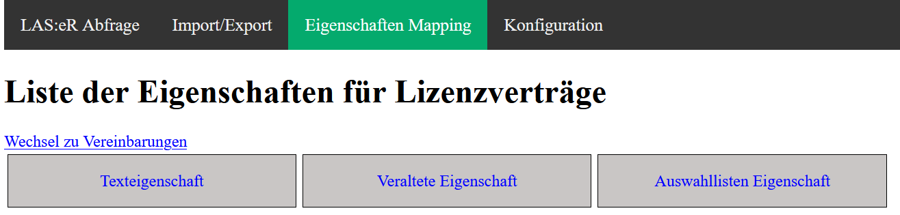
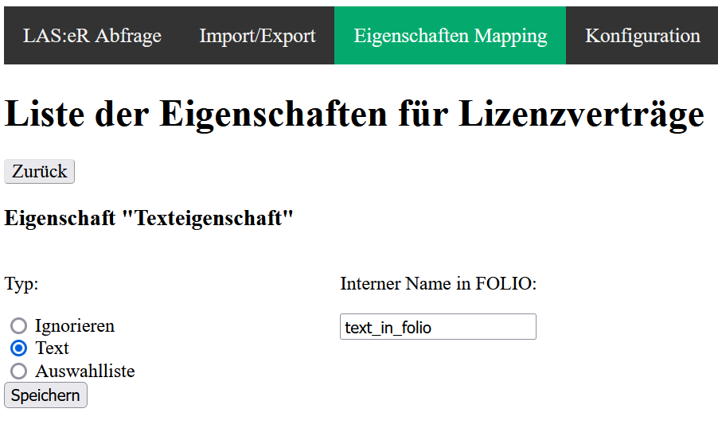
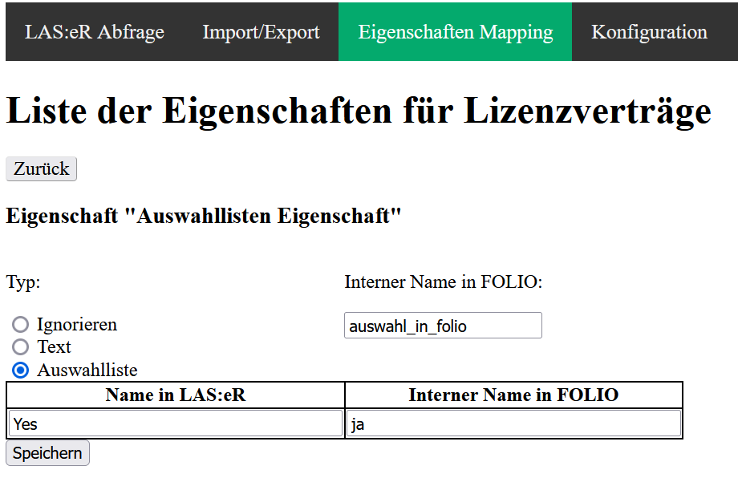
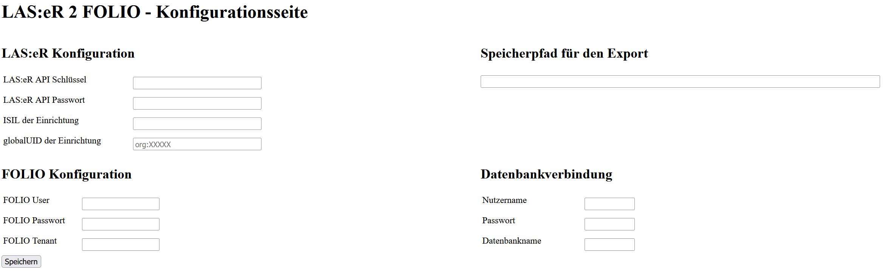

# LAS:eR to FOLIO

❗ LAS:eR to FOLIO only supports **local licenses and contracts** at the moment.
# Running

## Prerequisites
Ensure that PHP is installed (version 8.1 or later) and that the system used has network access to the LAS:eR and FOLIO APIs.

## Starting the application
Clone this repository:
```
git clone URL
```
Enter the cloned directory:
```
cd laser-to-folio
```
Start built-in php web server:
```
php -S localhost:8000
```
LAS:eR to FOLIO can now be accessed locally in the web browser at localhost:8000.
On the first visit you will be redirected to the configuration page.
# Usage
## "LAS:eR Abfrage"
Outputs additional information to a given resource via the LAS:eR API.
Currently only licenses and subscriptions are supported.

## Import/Export
Export data from LAS:eR to local storage or import locally stored data into FOLIO.
The IDs of imported resources get stored in a local SQLite database to prevent duplicate imports.
If a resource was deleted in FOLIO, it's entry in the database also needs to be deleted, else it will not get imported again.

## Mapping
Map LAS:eR properties of subscriptions/licenses that appear in locally stored resources to FOLIO properties.
{width=80%}

Click on a property to map it to FOLIO.
Input the internal name for the property in FOLIO (found in the settings app).
There is three options for every property:
- "Ignorieren"
	- Skips the property during import
{width=75%}

- "Text"
	- The LAS:eR property has a text value and should be copied over into FOLIO
{width=75%}

- "Auswahlliste"
	- The LAS:eR property is a selection list
	- Upon selecting this option a table is shown with the first column listing every value found for this property in the local data and the second column being for the corresponding internal name in FOLIO
{width=75%}

## Configuration
Used to setup the credentials for both APIs and the path for exported resources.
❗ The user identified by "FOLIO User" and "FOLIO Passwort" is required to have the permissions needed to create new resources in FOLIO or else the import will not work correctly.
{width=90%}


# Example data
This repository contains example data to test the import process.
To use this data set the export path to "demo".
